# Analisis de Datos Oncologicos del Registro Institucional de Tumores de Argentina (RITA 2012-2022)

## Aplicacion de Tecnicas de Machine Learning No Supervisado

**Materia:** Machine Learning  
**Universidad Nacional de San Agustin (UNSA)**

---

## Descripcion del Proyecto

El cancer es una de las principales causas de mortalidad a nivel mundial. Este proyecto aplica tecnicas de Machine Learning sobre el dataset RITA (Registro Institucional de Tumores de Argentina, periodo 2012-2022) para **descubrir patrones y perfiles ocultos** en la poblacion oncologica argentina, utilizando un enfoque de aprendizaje **no supervisado** (K-Modes) que segmenta a los pacientes en grupos con caracteristicas clinicas y demograficas similares.

El dataset contiene **82,106 registros** de pacientes con informacion demografica (sexo, edad) y clinica (localizacion anatomica del tumor, tipo histologico de celulas) codificada segun el estandar internacional **CIE-O-3**.

---

## Metodologia

El proyecto sigue la metodologia **CRISP-DM** en 5 fases:

1. **Pre-procesado y limpieza** de datos crudos
2. **Analisis Exploratorio de Datos (EDA)** para comprender distribuciones y relaciones
3. **Aprendizaje No Supervisado** con K-Modes para descubrir agrupamientos
4. **Experimentacion con multiples valores de K** (K=4 a K=7)
5. **Analisis critico** sobre la viabilidad del aprendizaje supervisado con este dataset

---

## Estructura del Proyecto

```
machine-learning/
├── data/
│   ├── raw/                              # Datos originales
│   └── processed/                        # Datos limpios
│       ├── rita_limpio.csv               # Dataset limpio (82,106 registros)
│       └── rita-2012-2022.xlsx           # Fuente original
├── notebooks/
│   ├── 01_preprocesado_limpieza.ipynb    # Fase 1: Limpieza
│   ├── 02_eda_estadistica.ipynb          # Fase 2: EDA
│   ├── 03_aprendizaje_no_supervisado.ipynb # Fase 3: K-Modes
│   ├── 04_aprendizaje_supervisado.ipynb  # Fase 5: Supervisado (ejercicio)
│   ├── 05_experimentos_k_nosupervisado.ipynb # Fase 4: Experimentos K
│   └── 06_experimentos_k5_k6_k7.ipynb   # Fase 4: Experimentos K=5,6,7
├── reports/
│   ├── 00_PROYECTO_FINAL_DE_DEFENSA.md   # Informe final de defensa
│   ├── 01_reporte_procesado.md           # Reporte de limpieza
│   ├── 02_reporte_eda.md                 # Reporte de EDA
│   ├── 03_reporte_nosupervisado.md       # Reporte de K-Modes
│   ├── 04_reporte_supervisado.md         # Reporte supervisado
│   ├── RESULTADOS_ANALISIS.md            # Resumen de resultados
│   ├── figures/                          # Graficos principales
│   └── k_experimentos/                   # Experimentos con K
│       ├── REPORTE_K_EXPERIMENTOS.md
│       └── figures/                      # 15 visualizaciones por K
├── models/                               # Modelos entrenados
├── src/                                  # Codigo fuente reutilizable
└── requirements.txt
```

---

## Fase 1: Pre-procesado y Limpieza

Se realizo la limpieza del dataset original de 82,106 registros:

- **Limpieza de columnas:** Normalizacion de nombres con `.str.strip()` para eliminar espacios.
- **Valores ausentes:** 17 nulos en `TOPOGRAFIA` (0.02%) y 240 en `MORFOLOGIA` (0.29%), excluidos en modelado.
- **Outliers:** Deteccion con IQR sobre `EDAD_DIAGNOSTICO` (Q1=44, Q3=66, IQR=22). Se encontro 1 valor extremo (edad > 100).
- **Recodificacion:** Columna `SEXO_NUM` (Hombre=0, Mujer=1) y `EDAD_RANGO` con 4 categorias (Infantil-Juvenil, Adulto Joven, Adulto, Adulto Mayor).

**Dataset generado:** `data/processed/rita_limpio.csv`

---

## Fase 2: Analisis Exploratorio de Datos (EDA)

### Estadistica Descriptiva

| Metrica | Valor |
|---------|-------|
| Total de registros | 82,106 |
| Edad promedio | 55.08 anos |
| Edad mediana | 57 anos |
| Desviacion estandar | 15.45 anos |
| Proporcion mujeres | 59.8% |
| Proporcion hombres | 40.2% |

### Diferencias por Sexo

| Sexo | Edad Promedio | Mediana |
|------|---------------|---------|
| Hombres | 57.9 anos | 60 anos |
| Mujeres | 53.1 anos | 54 anos |

Las mujeres tienden a ser diagnosticadas a una edad mas temprana, explicado por la alta incidencia del cancer de mama y las lesiones cervicales precancerosas (NIC III) detectadas en edades tempranas mediante programas de screening.

### Distribucion de Edad al Diagnostico

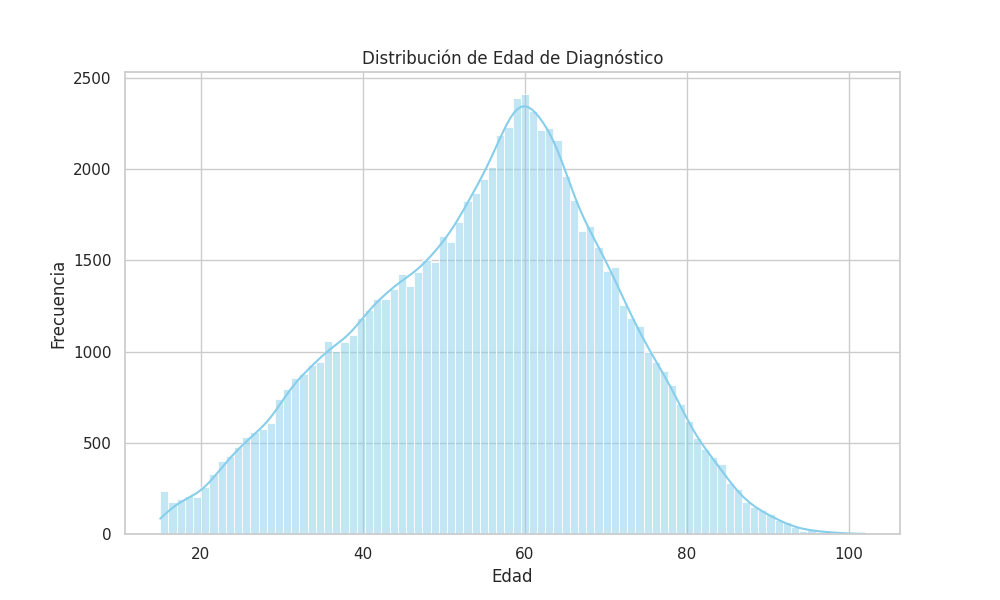

*Figura 1: Distribucion de la edad de diagnostico. Se observa una distribucion asimetrica hacia la derecha con pico entre 55 y 65 anos.*

### Matriz de Correlacion

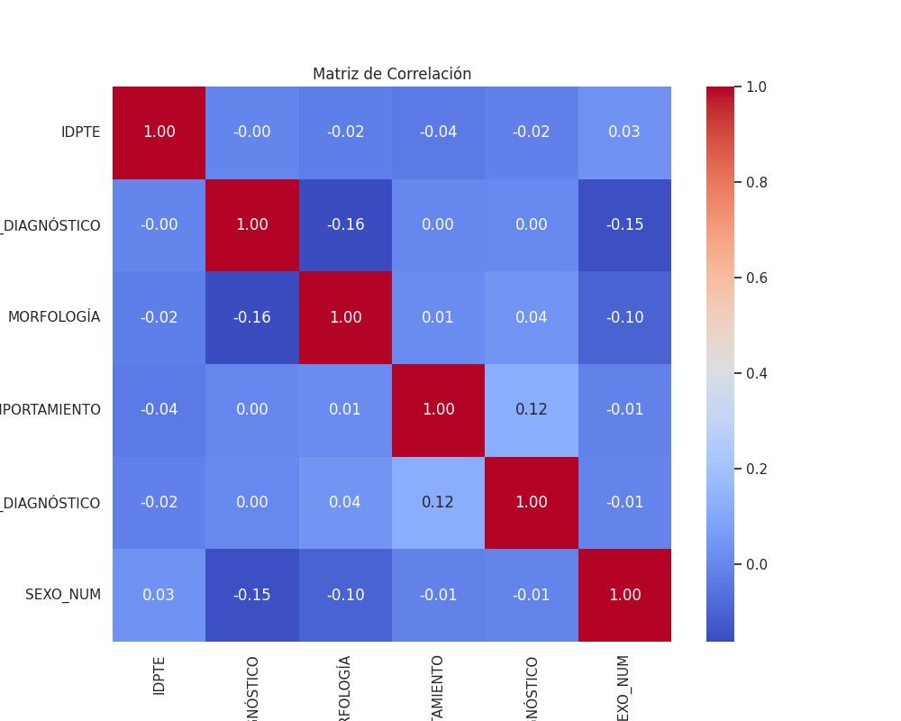

*Figura 2: No se encontraron correlaciones lineales fuertes, lo que indica que las relaciones entre diagnostico y demografia son complejas y no lineales, favoreciendo modelos basados en arboles o clustering.*

---

## Fase 3: Aprendizaje No Supervisado (K-Modes)

### Por que K-Modes y no K-Means?

Las variables principales (sexo, topografia, morfologia) son **categoricas**. K-Means calcula centroides como promedios y usa distancia euclidiana, lo cual carece de sentido con datos categoricos. K-Modes usa la **moda** como centroide y mide **disimilitud** (distancia de Hamming).

### Variables Seleccionadas

| Variable | Justificacion |
|----------|---------------|
| PTESXN (Sexo) | Diferenciacion biologica fundamental en oncologia |
| TOPOGRAFIA_N | Localizacion anatomica del tumor (codificacion CIE-O-3) |
| MORFOLOGIA_N | Tipo histologico de las celulas tumorales |
| EDAD_RANGO | Segmentacion por etapa de vida (4 categorias) |

### Metodo del Codo (Elbow Method)

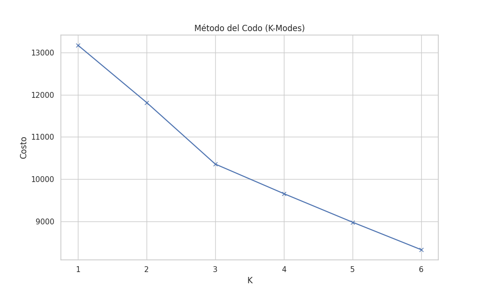

*Figura 3: El punto de inflexion se identifica en K=4, donde la reduccion del costo se estabiliza.*

### Resultados del Modelo Base (K=4)

| Cluster | Sexo | Topografia | Morfologia | Edad | N (%) |
|---------|------|------------|------------|------|-------|
| **0** | Mujer | Mama (C50.9) | Adenocarcinoma (8140) | Adulto Mayor | 24,851 (30.3%) |
| **1** | Hombre | Testiculo (C62.9) | Adenocarcinoma (8140) | Adulto | 22,583 (27.5%) |
| **2** | Mujer | Mama (C50.9) | Adenocarcinoma (8140) | Adulto | 21,752 (26.5%) |
| **3** | Mujer | Cuello uterino (C53.9) | NIC III (8077) | Adulto Joven | 12,920 (15.7%) |

**Interpretacion clinica:**
- **Cluster 0:** Mujeres mayores de 65 con cancer de mama. Perfil epidemiologico tipico.
- **Cluster 1:** Hombres adultos (45-65). Agrupa toda la poblacion masculina adulta (testiculo, pulmon, colon, prostata). El mas heterogeneo.
- **Cluster 2:** Mujeres adultas (45-65) con cancer de mama. Se diferencia del cluster 0 por edad.
- **Cluster 3:** Mujeres jovenes (18-45) con lesiones precancerosas cervicales (NIC III). Critico para prevencion temprana y vacunacion VPH.

---

## Fase 4: Experimentos con Diferentes Valores de K

### Evolucion del Costo

| K | Costo | Reduccion vs. anterior |
|---|-------|------------------------|
| 4 | 150,855 | -- |
| 5 | 141,494 | -6.2% |
| 6 | 136,195 | -3.7% |
| 7 | 131,579 | -3.4% |

### K=5: Separacion de patologia masculina por edad

Se descubre un cluster de **cancer de prostata en adultos mayores** (100% hombres, 97.6% >65 anos), separando la patologia masculina en dos perfiles clinicamente distintos: cancer testicular (jovenes) vs cancer de prostata (mayores).

#### Visualizaciones K=5

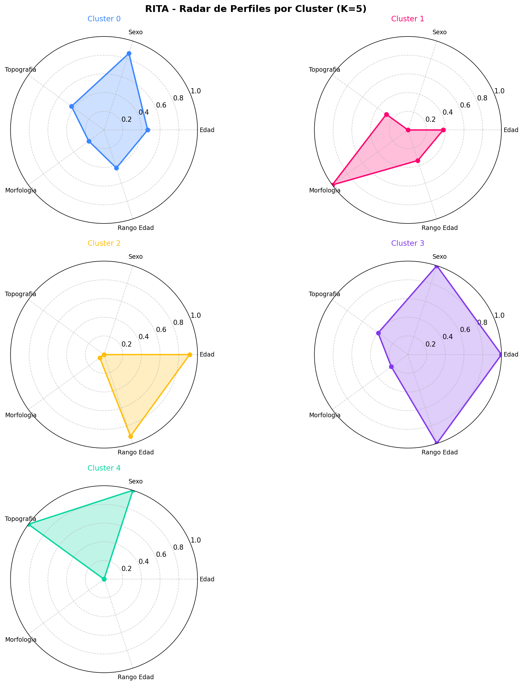

*Figura 4: Perfiles radar de los 5 clusters. Cada eje muestra la composicion del cluster en las variables utilizadas.*

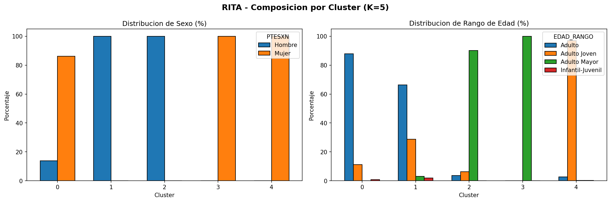

*Figura 5: Distribucion porcentual de sexo y edad en cada cluster para K=5.*

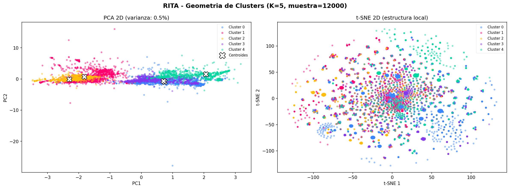

*Figura 6: Proyecciones PCA y t-SNE de los clusters para K=5.*

### K=6: Distincion de subtipos histologicos

Doble segmentacion:
1. **En mama:** Se separa el **Carcinoma Ductal Infiltrante (8500)** del Adenocarcinoma generico (subtipo mas comun y agresivo, 70-80% de casos).
2. **En cuello uterino:** Se separa **NIC III precanceroso** en jovenes vs **cancer cervical invasivo** en adultas.

#### Visualizaciones K=6

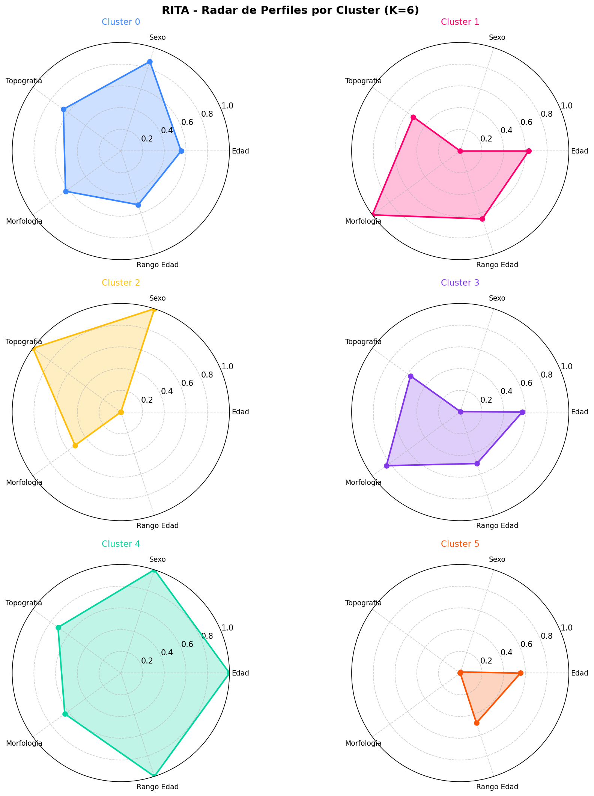

*Figura 7: Perfiles radar de los 6 clusters mostrando la nueva separacion histologica.*

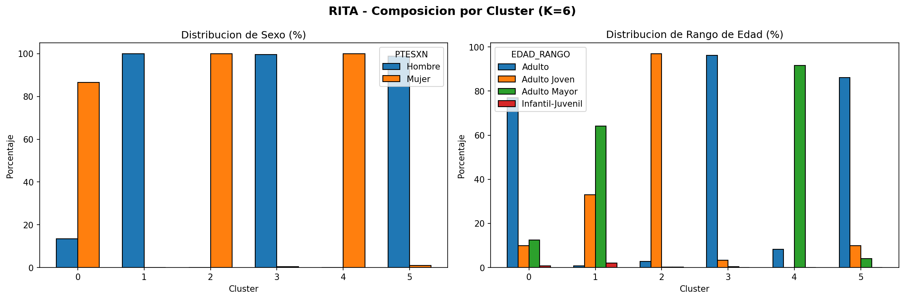

*Figura 8: Composicion demografica por cluster para K=6.*

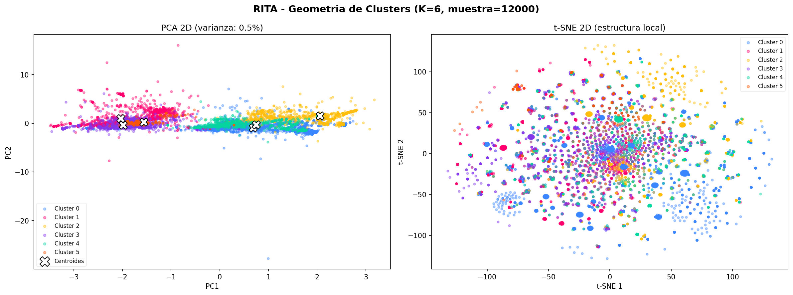

*Figura 9: Proyecciones PCA y t-SNE de los clusters para K=6.*

### K=7: Cancer colorrectal como grupo emergente

Aparece un cluster de **cancer colorrectal masculino** (100% hombres, 95.9% adultos 45-65, topografias de recto 21% y colon 11.1%), confirmando su relevancia epidemiologica.

#### Visualizaciones K=7

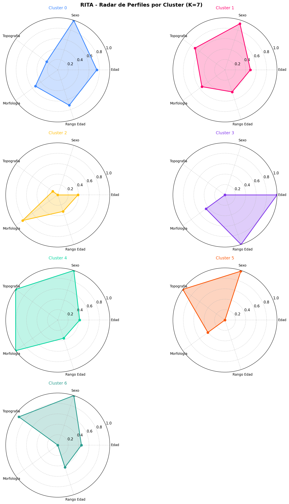

*Figura 10: Perfiles radar de los 7 clusters incluyendo el grupo de cancer colorrectal.*

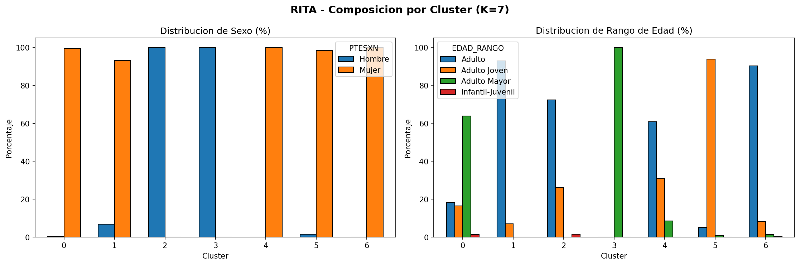

*Figura 11: Composicion demografica por cluster para K=7.*

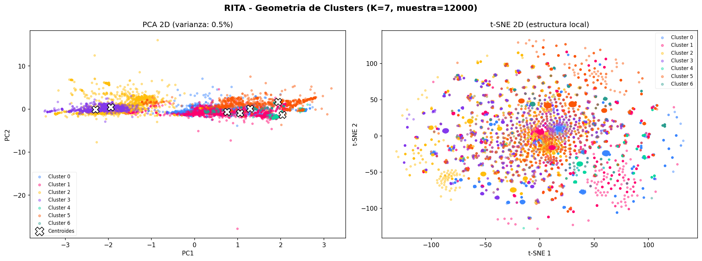

*Figura 12: Proyecciones PCA y t-SNE de los clusters para K=7.*

### Mapa de Perfiles Descubiertos por K

| Perfil Clinico | K=4 | K=5 | K=6 | K=7 |
|---------------|:---:|:---:|:---:|:---:|
| Mama, Adulto Mayor | x | x | x | x |
| Mama, Adulto | x | x | -- | -- |
| Mama, Carcinoma Ductal Infiltrante | -- | -- | x | x |
| Cuello uterino, NIC III, Adulto Joven | x | x | x | x |
| Cuello uterino, Adulto (invasivo) | -- | -- | x | x |
| Hombres, Testiculo, Adulto | x | x | x | x |
| Hombres, Prostata, Adulto Mayor | -- | x | x | x |
| Hombres, Colorrectal, Adulto | -- | -- | -- | x |

Cada incremento de K revela un subgrupo clinicamente relevante que estaba "oculto" dentro de un cluster mas grande.

### Cual es el Mejor K?

No existe un K "correcto" unico. La eleccion depende del proposito:

- **K=4 (resumen ejecutivo):** Vision general. Captura los 3 canceres mas frecuentes por sexo.
- **K=5 (politicas de salud publica):** Diferencia perfiles por sexo y edad. Separacion prostata/testiculo clinicamente imprescindible.
- **K=6 (planificacion hospitalaria):** Mejor relacion detalle/parsimonia. Distingue subtipos histologicos.
- **K=7 (investigacion epidemiologica):** Maxima granularidad sin fragmentacion. Incluye cancer colorrectal.

---

## Fase 5: Aprendizaje Supervisado (Ejercicio Academico)

### Limitacion Estructural del Dataset

El dataset RITA registra informacion del **diagnostico** pero **no contiene datos sobre el resultado o desenlace** (supervivencia, respuesta al tratamiento, estadio TNM, recurrencia). Sin una variable objetivo clinicamente significativa, el aprendizaje supervisado tiene utilidad limitada.

Como ejercicio academico, se utilizo el **sexo** como variable objetivo, obteniendo:

| Modelo | Accuracy | Precision | Recall | F1-Score |
|--------|----------|-----------|--------|----------|
| **Random Forest** | 0.771 | 0.790 | 0.771 | 0.770 |
| **XGBoost** | 0.784 | 0.840 | 0.784 | 0.780 |

Se aplico **SMOTE** para balanceo de clases (~60% mujeres, ~40% hombres) y **GridSearchCV** para optimizacion.

### Matriz de Confusion

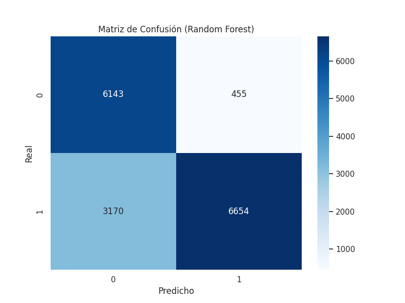

*Figura 13: Matriz de confusion del modelo XGBoost. Los modelos son precisos al identificar tumores genero-especificos (mama, prostata, cuello uterino) pero presentan errores en diagnosticos generales como "Adenocarcinoma de Sitio Primario No Especificado".*

### Analisis Critico

La prediccion del sexo presenta **circularidad biologica**: la topografia del tumor (variable mas predictiva) esta directamente determinada por el sexo en muchos casos. Un modelo supervisado valido requeriria datos de supervivencia, estadio o respuesta al tratamiento.

---

## Visualizaciones del Modelo Base (K=4)

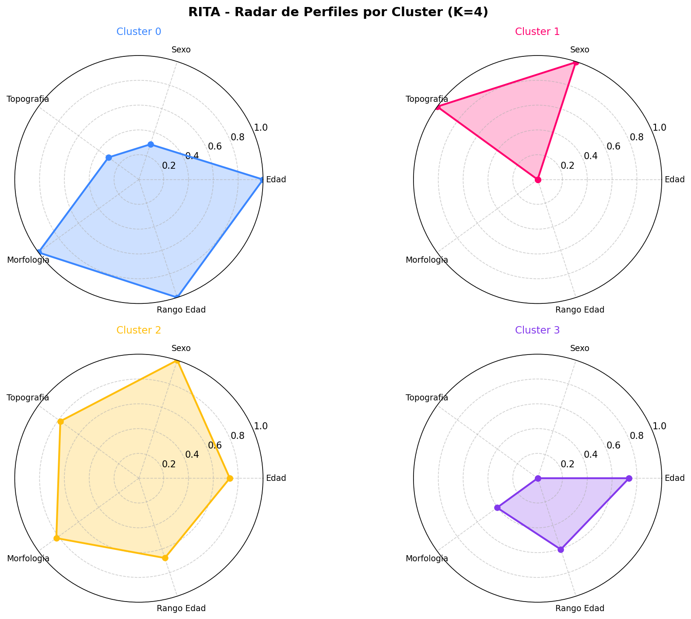

*Figura 14: Perfiles radar del modelo base con 4 clusters.*

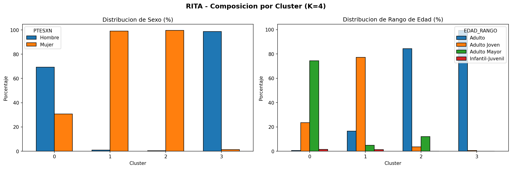

*Figura 15: Composicion demografica por cluster para el modelo base K=4.*

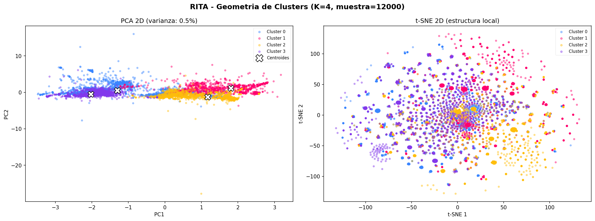

*Figura 16: Proyecciones PCA y t-SNE para el modelo base K=4.*

---

## Conclusiones

1. **Pre-procesamiento riguroso:** Se limpio y preparo un dataset de 82,106 registros oncologicos, tratando valores nulos, outliers y recodificando variables.

2. **EDA completo:** Se identificaron distribuciones clave, diferencias demograficas por sexo y la ausencia de correlaciones lineales, orientando la seleccion de algoritmos.

3. **Segmentacion exitosa con K-Modes:** El modelo no supervisado identifico entre 4 y 7 perfiles clinicos de pacientes, separando exitosamente:
   - Cancer de mama por rango de edad (adultas vs adultas mayores)
   - Cancer de mama por subtipo histologico (adenocarcinoma generico vs carcinoma ductal infiltrante)
   - Patologia masculina por edad (testiculo en jovenes vs prostata en mayores)
   - Lesiones cervicales precancerosas en mujeres jovenes
   - Cancer colorrectal masculino como grupo emergente

4. **Experimentacion sistematica:** Los experimentos con K=4 a K=7 demuestran que cada incremento descubre subgrupos clinicamente relevantes con un patron claro de "descubrimiento progresivo".

5. **Analisis critico del supervisado:** Se identifico y documento la limitacion estructural del dataset para aprendizaje supervisado, explicando por que el enfoque no supervisado es el adecuado.

### Limitaciones

- K-Modes es sensible a la inicializacion (mitigado con `n_init=5`).
- Discretizacion de edad en 4 rangos pierde informacion (alternativa: K-Prototypes).
- Las modas representan solo el valor mas frecuente de cada cluster.
- El metodo del codo es heuristico (complementar con indice de silueta o Calinski-Harabasz).

### Trabajo Futuro

- Obtener datos complementarios (supervivencia, estadio, tratamiento) para modelos supervisados validos.
- Explorar K-Prototypes para mantener la edad como variable continua.
- Aplicar analisis de asociacion dentro de cada cluster.
- Expandir experimentacion a K=8, 9, 10 evaluando fragmentacion.

---

## Herramientas y Librerias

- **Python 3.x** - Lenguaje de programacion
- **Pandas** - Manipulacion y analisis de datos
- **Matplotlib / Seaborn** - Visualizacion estadistica
- **kmodes** - Algoritmo K-Modes para datos categoricos
- **scikit-learn** - LabelEncoder, metricas y utilidades de ML
- **SMOTE (imblearn)** - Balanceo de clases
- **XGBoost** - Modelo de clasificacion

## Primeros Pasos

1. **Entorno:** Crea un entorno virtual e instala dependencias:
   ```bash
   python -m venv .venv
   source .venv/bin/activate  # Linux/Mac
   pip install -r requirements.txt
   ```

2. **Dataset:** El dataset limpio se encuentra en `data/processed/rita_limpio.csv`.

3. **Notebooks:** Ejecuta los notebooks en orden numerico desde `notebooks/`.

---

*Proyecto desarrollado para la materia de Machine Learning - Universidad Nacional de San Agustin (UNSA)*
